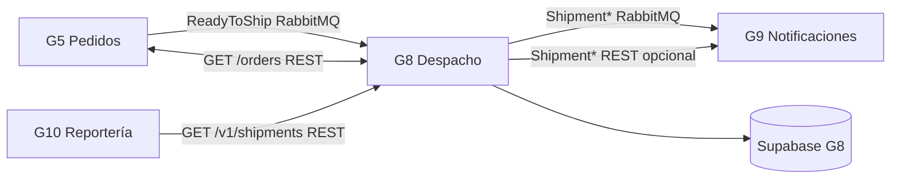

# E4 Integración — Plan de entrega G8

## Objetivo

Demostrar integración real con **G5**, **G9** y exposición REST para **G10**, usando **RabbitMQ + REST híbrido**.

---

## Qué hace cada grupo

---

## Pasos para entregar

### Paso 1 — Configuración (hoy)

1. Obtener `RABBITMQ_URL` del broker compartido (CloudAMQP / curso)
2. Variables en `.env` local y **Render**
3. `G5_ORDER_SERVICE_URL` y `G9_NOTIFICATION_SERVICE_URL`
4. Redeploy G8 en Render

### Paso 2 — Acuerdo con grupos

| Grupo | Qué acordar |
|-------|-------------|
| G5 | Exchange, routing key `ReadyToShip`, `GET /orders/{id}`, orderId prueba |
| G9 | Bind cola a `shipment.*`, confirmar recepción |
| G10 | URL REST de G8 para reportería |

### Paso 3 — Pruebas

| # | Prueba | Resultado |
|---|--------|-----------|
| 1 | `/health` → `rabbitmq: connected` | OK |
| 2 | G5 publica ReadyToShip | Envío creado en G8 |
| 3 | G8 publica ShipmentCreated | G9 recibe |
| 4 | Flujo hasta DELIVERED | ShipmentDelivered en G9 |
| 5 | Reject | ShipmentFailed |
| 6 | Idempotencia / 409 / 412 | Bruno colección existente |

Antes de Bruno: ejecutar `docs/seed.sql`.

### Paso 4 — Evidencias

Carpeta `docs/integracion/evidencias/`:

- `01-health-rabbitmq.png`
- `02-g5-evento-consumido.png`
- `03-g9-evento-recibido.png`
- `04-supabase-shipment.png`
- `05-logs-correlation-id.png`
- `06-error-422.png`

### Paso 5 — Presentación

1. Diagrama de arquitectura E4
2. Demo flujo feliz (G5 → G8 → G9)
3. Demo error (pedido no listo o G9 caído)
4. Patrón técnico: **pub/sub RabbitMQ + idempotencia**

---

## URLs G8 para compartir

| Uso | URL |
|-----|-----|
| API | `https://arq-microservicio-de-despacho-y-logistica.onrender.com` |
| Swagger | `.../api-docs` |
| Health | `.../health` |
| Listar envíos (G10) | `GET .../v1/shipments` |
| Crear envío (G5 REST alternativo) | `POST .../v1/shipments` |

---

## Rúbrica E4 → evidencia

| Criterio | Evidencia |
|----------|-----------|
| Integración real 25% | Flujo G5→G8→G9 con capturas/video |
| Contrato 20% | OpenAPI + JSON real de eventos |
| Errores 15% | 422, 409, log G9 caído |
| Trazabilidad 10% | `correlationId` en logs Rabbit |
| Patrón técnico 20% | RabbitMQ pub/sub + idempotencia |
| Pruebas 10% | Bruno + prueba manual Rabbit |
